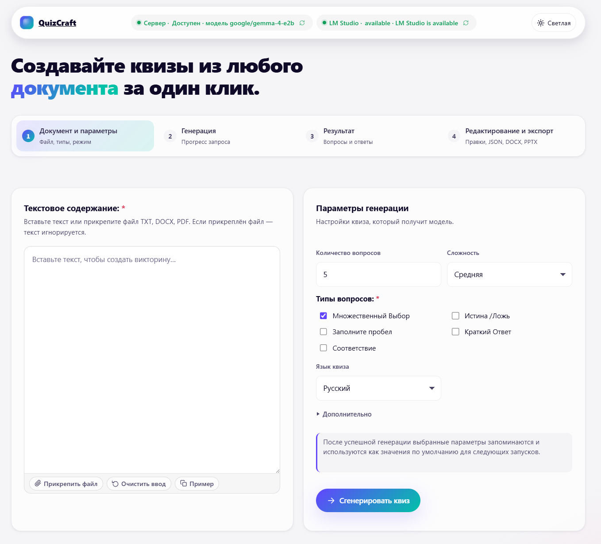

# QuizCraft

<p align="center">
  
</p>

<p align="center">
  <strong>Локальная генерация квизов из TXT, DOCX и PDF с поддержкой русского языка.</strong>
</p>

QuizCraft - веб-приложение для создания учебных квизов из документов. Пользователь загружает файл, выбирает параметры и типы вопросов, запускает локальную LLM, редактирует результат в браузере и экспортирует квиз в удобный формат.

Проект рассчитан на локальный запуск: документы, промежуточные данные и готовые квизы хранятся на вашей машине. Основные сценарии работают с LM Studio, Ollama или совместимым внешним OpenAI-style API.

## Возможности

- Загрузка документов TXT, DOCX и PDF.
- Генерация квизов по документу через прямой режим или RAG для длинных материалов.
- Выбор нескольких типов вопросов одновременно:
  - множественный выбор;
  - истина / ложь;
  - заполните пробел;
  - краткий ответ;
  - соответствие.
- Редактор квиза с изменением вопросов, вариантов, ответов и пояснений.
- Перегенерация отдельного вопроса без пересоздания всего квиза.
- Экспорт в JSON, DOCX, PPTX, Markdown и CSV.
- Проверки доступности backend и LLM-провайдера с понятными ошибками в интерфейсе.
- Сохранение кириллицы на пути документ -> генерация -> хранение -> API -> UI -> экспорт.

## Стек

- Backend: FastAPI, Pydantic, pypdf, python-docx, python-pptx.
- Frontend: HTML, CSS, JavaScript без frontend-фреймворка.
- LLM: LM Studio, Ollama, внешний OpenAI-compatible API.
- Хранилище: JSON-файлы в локальной директории `.quizcraft/`.
- Тесты и качество: pytest, ruff.

## Требования

- Git.
- Python 3.12 или новее.
- Современный браузер: Chrome, Edge, Firefox, Safari.
- Один LLM-провайдер:
  - LM Studio с запущенным Local Server;
  - Ollama с загруженной моделью;
  - внешний OpenAI-compatible API.

Node.js не нужен: frontend запускается обычным статическим HTTP-сервером Python.

## Быстрый старт

```powershell
git clone https://github.com/bk-ru/quizcraft.git
cd quizcraft
py -3.12 -m venv .venv
.\.venv\Scripts\Activate.ps1
python -m pip install --upgrade pip
pip install -e ".[dev]"
Copy-Item .env.example .env
.\run-backend.ps1
```

Во втором окне терминала:

```powershell
cd quizcraft
.\run-frontend.ps1
```

Откройте приложение: `http://127.0.0.1:5500`.

Backend API будет доступен на `http://127.0.0.1:8000`.

## Установка на Windows

Откройте PowerShell.

```powershell
git clone https://github.com/bk-ru/quizcraft.git
cd quizcraft
py -3.12 -m venv .venv
.\.venv\Scripts\Activate.ps1
python -m pip install --upgrade pip
pip install -e ".[dev]"
Copy-Item .env.example .env
```

Если PowerShell блокирует активацию виртуального окружения:

```powershell
Set-ExecutionPolicy -Scope CurrentUser RemoteSigned
.\.venv\Scripts\Activate.ps1
```

Запуск backend:

```powershell
.\run-backend.ps1
```

Запуск frontend в отдельном окне PowerShell:

```powershell
.\run-frontend.ps1
```

Ручной запуск без скриптов:

```powershell
uvicorn backend.app.main:app --host 127.0.0.1 --port 8000 --reload
python -m http.server 5500 --directory frontend
```

## Установка на macOS

```bash
git clone https://github.com/bk-ru/quizcraft.git
cd quizcraft
python3.12 -m venv .venv
source .venv/bin/activate
python -m pip install --upgrade pip
pip install -e ".[dev]"
cp .env.example .env
```

Если `python3.12` недоступен, установите Python 3.12 через официальный installer, Homebrew или pyenv.

Запуск backend:

```bash
source .venv/bin/activate
uvicorn backend.app.main:app --host 127.0.0.1 --port 8000 --reload
```

Запуск frontend во втором терминале:

```bash
cd quizcraft
python -m http.server 5500 --directory frontend
```

## Установка на Linux

```bash
git clone https://github.com/bk-ru/quizcraft.git
cd quizcraft
python3.12 -m venv .venv
source .venv/bin/activate
python -m pip install --upgrade pip
pip install -e ".[dev]"
cp .env.example .env
```

На Debian/Ubuntu может понадобиться пакет виртуальных окружений:

```bash
sudo apt update
sudo apt install python3.12 python3.12-venv
```

Запуск backend:

```bash
source .venv/bin/activate
uvicorn backend.app.main:app --host 127.0.0.1 --port 8000 --reload
```

Запуск frontend во втором терминале:

```bash
cd quizcraft
python -m http.server 5500 --directory frontend
```

## Настройка LM Studio

1. Установите LM Studio.
2. Загрузите chat-модель.
3. Откройте вкладку Local Server.
4. Запустите сервер на `http://localhost:1234/v1`.
5. Укажите имя модели в `.env`.

Минимальная настройка:

```env
PROVIDERS_ENABLED=lm_studio
DEFAULT_PROVIDER=lm_studio
LM_STUDIO_BASE_URL=http://localhost:1234/v1
LM_STUDIO_MODEL=google/gemma-4-e2b
```

Если хотите ограничить список моделей, добавьте:

```env
LM_STUDIO_ALLOWED_MODELS=google/gemma-4-e2b
```

## Настройка Ollama

1. Установите Ollama.
2. Запустите сервис Ollama.
3. Загрузите модель.

```bash
ollama pull qwen2.5:7b
```

Пример `.env`:

```env
PROVIDERS_ENABLED=ollama
DEFAULT_PROVIDER=ollama
OLLAMA_BASE_URL=http://localhost:11434
OLLAMA_MODEL=qwen2.5:7b
OLLAMA_EMBEDDING_MODEL=nomic-embed-text
LM_STUDIO_MODEL=qwen2.5:7b
LM_STUDIO_ALLOWED_MODELS=qwen2.5:7b
```

`LM_STUDIO_MODEL` остается в конфигурации как обязательное базовое поле приложения, даже если активный провайдер - Ollama.

## Настройка внешнего API

Используйте этот вариант для OpenAI-compatible endpoint.

```env
PROVIDERS_ENABLED=external_api
DEFAULT_PROVIDER=external_api
EXTERNAL_API_BASE_URL=https://example.com/v1
EXTERNAL_API_API_KEY=replace-with-token
EXTERNAL_API_MODEL=replace-with-model
EXTERNAL_API_EMBEDDING_MODEL=replace-with-embedding-model
LM_STUDIO_MODEL=replace-with-model
LM_STUDIO_ALLOWED_MODELS=replace-with-model
```

Не коммитьте `.env`: файл содержит локальные пути и секреты.

## Конфигурация

Основные переменные окружения:

| Переменная | Назначение | Значение по умолчанию |
|---|---|---|
| `QUIZCRAFT_ENV_FILE` | Путь к env-файлу | `.env` |
| `PROVIDERS_ENABLED` | Список активных провайдеров через запятую | `lm_studio` |
| `DEFAULT_PROVIDER` | Провайдер по умолчанию | первый из `PROVIDERS_ENABLED` |
| `LM_STUDIO_BASE_URL` | URL LM Studio API | `http://localhost:1234/v1` |
| `LM_STUDIO_MODEL` | Имя модели LM Studio или базовая модель приложения | из `.env.example` |
| `LM_STUDIO_ALLOWED_MODELS` | Разрешенные модели через запятую | пусто |
| `OLLAMA_BASE_URL` | URL Ollama API | `http://localhost:11434` |
| `OLLAMA_MODEL` | Chat-модель Ollama | пусто |
| `OLLAMA_EMBEDDING_MODEL` | Embedding-модель Ollama | пусто |
| `EXTERNAL_API_BASE_URL` | URL внешнего OpenAI-compatible API | пусто |
| `EXTERNAL_API_API_KEY` | API-ключ внешнего провайдера | пусто |
| `EXTERNAL_API_MODEL` | Chat-модель внешнего провайдера | пусто |
| `EXTERNAL_API_EMBEDDING_MODEL` | Embedding-модель внешнего провайдера | пусто |
| `REQUEST_TIMEOUT` | Таймаут запросов к LLM в секундах | `300` |
| `MAX_FILE_SIZE_MB` | Максимальный размер загружаемого файла | `10` |
| `MAX_DOCUMENT_CHARS` | Максимальный объем текста документа | `50000` |
| `LOG_LEVEL` | Уровень логирования | `INFO` |
| `LOG_FORMAT` | Формат логов: `text` или `json` | `text` |
| `GENERATION_PROFILES` | JSON с профилями генерации | пусто |
| `DEFAULT_GENERATION_PROFILE` | Профиль генерации по умолчанию | `balanced` |

## Как пользоваться

1. Запустите backend, frontend и выбранный LLM-провайдер.
2. Откройте `http://127.0.0.1:5500`.
3. Загрузите TXT, DOCX или PDF.
4. Выберите количество вопросов, сложность, язык и типы вопросов.
5. Нажмите "Сгенерировать квиз".
6. Проверьте результат и при необходимости отредактируйте вопросы.
7. Экспортируйте квиз в нужный формат.

Если backend или LLM недоступны, интерфейс покажет ошибку до генерации или во время запроса.

## API

| Метод | Путь | Назначение |
|---|---|---|
| `GET` | `/health` | Проверка backend |
| `GET` | `/health/lm-studio` | Проверка LM Studio |
| `GET` | `/health/ollama` | Проверка Ollama |
| `GET` | `/health/external-api` | Проверка внешнего API |
| `POST` | `/documents` | Загрузка документа |
| `POST` | `/documents/{document_id}/generate` | Генерация квиза |
| `GET` | `/quizzes/{quiz_id}` | Получение квиза |
| `PUT` | `/quizzes/{quiz_id}` | Обновление квиза |
| `POST` | `/quizzes/{quiz_id}/questions/{question_id}/regenerate` | Перегенерация вопроса |
| `GET` | `/quizzes/{quiz_id}/export/json` | Экспорт JSON |
| `GET` | `/quizzes/{quiz_id}/export/{export_format}` | Экспорт DOCX, PPTX, Markdown или CSV |
| `GET` | `/export/formats` | Список форматов экспорта |
| `GET` | `/generation/settings` | Настройки генерации для UI |

## Форматы экспорта

| Формат | Расширение | Содержимое |
|---|---|---|
| JSON | `.json` | Полная структура квиза |
| DOCX | `.docx` | Карточки вопросов и отдельный ключ ответов |
| PPTX | `.pptx` | Презентация в quiz-show стиле |
| Markdown | `.md` | Текстовая версия для LMS, Git и заметок |
| CSV | `.csv` | Табличная версия для Excel и импорта |

## Структура проекта

```text
quizcraft/
├── backend/
│   ├── app/
│   │   ├── api/          # FastAPI routes
│   │   ├── core/         # config, logging, provider registry
│   │   ├── domain/       # models, validation, normalization, errors
│   │   ├── export/       # JSON, DOCX, PPTX, Markdown, CSV exporters
│   │   ├── generation/   # direct and RAG generation
│   │   ├── parsing/      # TXT, DOCX, PDF parsing and chunking
│   │   ├── prompts/      # prompt builders and repair prompts
│   │   └── storage/      # local JSON storage
│   └── tests/            # backend pytest tests
├── frontend/             # browser UI
├── docs/
│   ├── execplans/        # implementation plans
│   └── images/           # README and UI images
├── tests/                # repository and frontend shell tests
├── run-backend.ps1       # Windows backend launcher
└── run-frontend.ps1      # Windows frontend launcher
```

## Разработка

Установка dev-зависимостей:

```bash
pip install -e ".[dev]"
```

Проверки:

```bash
python -m pytest -q
python -m ruff check .
```

Быстрые проверки документации и структуры:

```bash
git diff --check
python -m pytest tests/test_repository_layout.py -q
```

Перед изменениями проверьте локальный статус:

```bash
git status --short
```

## Решение частых проблем

### Frontend открыт, но генерация не запускается

Проверьте, что backend работает:

```bash
curl http://127.0.0.1:8000/health
```

### Backend работает, но LLM недоступна

Для LM Studio проверьте Local Server и модель:

```bash
curl http://127.0.0.1:8000/health/lm-studio
```

Для Ollama:

```bash
curl http://127.0.0.1:8000/health/ollama
```

### PowerShell не активирует `.venv`

Выполните:

```powershell
Set-ExecutionPolicy -Scope CurrentUser RemoteSigned
```

### Порт уже занят

Остановите старый процесс или выберите другой порт:

```bash
uvicorn backend.app.main:app --host 127.0.0.1 --port 8001 --reload
python -m http.server 5501 --directory frontend
```

Если меняете порт backend, обновите frontend-конфигурацию в соответствии с текущими настройками проекта.

### Русский текст отображается некорректно

Проверьте, что файлы сохранены в UTF-8, а браузер открывает frontend через `http://127.0.0.1:5500`, а не напрямую с диска.

## Безопасность

- Не отправляйте приватные документы внешнему API, если не готовы передать их выбранному провайдеру.
- Не коммитьте `.env`, API-ключи и содержимое `.quizcraft/`.
- Для локального режима используйте LM Studio или Ollama.

## Лицензия

Лицензия не указана. Перед распространением или коммерческим использованием уточните условия у владельца репозитория.
