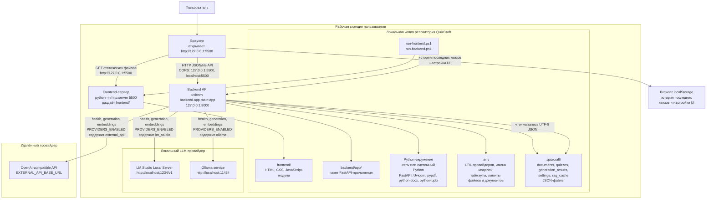

# QuizCraft Deployment Diagram for draw.io

This diagram is written in Mermaid format for diagrams.net / draw.io.

Import path in draw.io:

1. Open diagrams.net / draw.io.
2. Select `Insert -> Advanced -> Mermaid`.
3. Paste the Mermaid code below.

## Runtime Ports

- Frontend: `http://127.0.0.1:5500`, served from `frontend/` by `python -m http.server`.
- Backend: `http://127.0.0.1:8000`, served by Uvicorn from `backend.app.main:app`.
- LM Studio default: `http://localhost:1234/v1`.
- Ollama default: `http://localhost:11434`.
- External OpenAI-compatible API: configured by `EXTERNAL_API_BASE_URL`.

## Deployment Notes

- The application is designed as a local single-user deployment.
- The frontend and backend are separate local processes.
- Backend CORS explicitly allows `http://127.0.0.1:5500` and `http://localhost:5500`.
- Persistent application data is stored as UTF-8 JSON under `.quizcraft/`.
- `.env` controls active providers, default model, allowed models, generation profiles, timeouts, file size limits, and document length limits.
- Remote provider access is optional and only used when `external_api` is configured and enabled.

## Source Check

The diagram was checked against these implementation points:

- `run-frontend.ps1`: starts `python -m http.server` on port `5500` with `frontend/` as the document root.
- `run-backend.ps1`: starts `uvicorn backend.app.main:app` on port `8000`.
- `.env.example`: documents default LM Studio URL, request timeout, file size and document limits.
- `backend/app/main.py`: CORS origins, app state, provider runtime, storage root, route registration.
- `backend/app/api/runtime.py`: default `.quizcraft` storage root and filesystem-backed repositories.
- `backend/app/llm/factory.py`: LM Studio, Ollama, and external API provider runtime wiring.
