# Диаграмма классов: Domain

Описывает все доменные модели, ошибки и структуры данных приложения.

## Модели данных

- **Quiz** — корневая сущность квиза: `quiz_id`, `document_id`, `title`, `version`, `questions`. Поддерживает `to_dict` / `from_dict`.
- **Question** — вопрос: `question_type`, `prompt`, `options`, `correct_option_index`, `correct_answer`, `matching_pairs`, `explanation`.
- **Option** — вариант ответа: `option_id`, `text`.
- **Explanation** — пояснение к ответу: `text`.
- **MatchingPair** — пара для вопроса-соответствия: `left`, `right`.
- **DocumentRecord** — загруженный документ: `document_id`, `filename`, `media_type`, `normalized_text`, `file_size_bytes`, `metadata`.
- **GenerationRequest** — параметры запроса: режим, сложность, язык, количество вопросов, типы, профиль, параметры инференса.
- **GenerationResult** — результат: ссылки на `Quiz` и `GenerationRequest`, `model_name`, `prompt_version`.
- **GenerationSettings** — сохранённые настройки с методом `to_generation_request()`.
- **StructuredGenerationRequest** — запрос к LLM: system/user prompt, JSON-схема, параметры инференса.
- **StructuredGenerationResponse** — ответ LLM: `content`, `model_name`, `raw_response`.
- **EmbeddingRequest / EmbeddingResponse** — запрос и ответ для получения эмбеддингов.
- **ProviderHealthStatus** — статус доступности LLM-провайдера.

## Перечисления

- **Difficulty** — уровень сложности вопросов.
- **Language** — язык генерации.
- **QuizType** — тип вопроса (single_choice, true_false и др.).

## Иерархия ошибок

BackendError наследуют:
- **ConfigurationError**
- **DomainValidationError**: DocumentTooLargeForGenerationError, GenerationProfileError, GenerationQualityError, GenerationSettingsError, ModelSelectionError
- **ParsingError**: FileValidationError, TextExtractionError
- **LLMProviderError**: LLMConnectionError, LLMRequestError, LLMResponseFormatError, LLMServerError, LLMTimeoutError, ProviderDisabledError, UnsupportedProviderCapabilityError, UnsupportedProviderError
- **PromptResolutionError**, **RepositoryNotFoundError**, **UnsupportedExportFormatError**, **UnsupportedGenerationModeError**

## Диаграмма

```mermaid
classDiagram
  class BackendError {
    code : str
    message : str
  }
  class ConfigurationError {
    code : str
  }
  class Difficulty {
    name
  }
  class DocumentRecord {
    document_id : str
    file_size_bytes : int
    filename : str
    media_type : str
    metadata : dict[str, Any]
    normalized_text : str
    from_dict(payload: dict[str, Any]) DocumentRecord
    to_dict() dict[str, Any]
  }
  class DocumentTooLargeForGenerationError {
    code : str
  }
  class DomainValidationError {
    code : str
  }
  class EmbeddingRequest {
    model_name : str | None
    texts : tuple[str, ...]
  }
  class EmbeddingResponse {
    model_name : str
    vectors : tuple[tuple[float, ...], ...]
  }
  class Explanation {
    text : str
  }
  class FileValidationError {
    code : str
  }
  class GenerationProfileError {
    code : str
  }
  class GenerationQualityError {
    code : str
  }
  class GenerationRequest {
    difficulty : str
    generation_mode : GenerationMode
    inference_parameters : dict[str, Any]
    language : str
    model_name : str | None
    profile_name : str | None
    question_count : int
    quiz_type : str
    quiz_types : tuple[str, ...]
    from_dict(payload: dict[str, Any]) GenerationRequest
    to_dict() dict[str, Any]
  }
  class GenerationResult {
    model_name : str
    prompt_version : str
    quiz
    request
    from_dict(payload: dict[str, Any]) GenerationResult
    to_dict() dict[str, Any]
  }
  class GenerationSettings {
    difficulty : str
    generation_mode : GenerationMode
    language : str
    model_name : str | None
    profile_name : str | None
    question_count : int
    quiz_type : str
    from_dict(payload: dict[str, Any]) GenerationSettings
    merge(overrides: dict[str, Any]) GenerationSettings
    to_dict() dict[str, Any]
    to_generation_request() GenerationRequest
  }
  class GenerationSettingsError {
    code : str
  }
  class LLMConnectionError {
    code : str
    retryable : bool
  }
  class LLMProviderError {
    code : str
    retryable : bool
  }
  class LLMRequestError {
    code : str
    status_code : int
  }
  class LLMResponseFormatError {
    code : str
  }
  class LLMServerError {
    code : str
    retryable : bool
    status_code : int
  }
  class LLMTimeoutError {
    code : str
    retryable : bool
  }
  class Language {
    name
  }
  class MatchingPair {
    left : str
    right : str
  }
  class ModelSelectionError {
    code : str
  }
  class Option {
    option_id : str
    text : str
  }
  class ParsingError {
    code : str
  }
  class PromptResolutionError {
    code : str
  }
  class ProviderDisabledError {
    code : str
    provider_name : str
  }
  class ProviderHealthStatus {
    message : str
    status : str
  }
  class Question {
    correct_answer : str | None
    correct_option_index : int | None
    explanation : Explanation | None
    matching_pairs : tuple[MatchingPair, ...]
    options : tuple[Option, ...]
    prompt : str
    question_id : str
    question_type : str
  }
  class Quiz {
    document_id : str
    last_edited_at : str
    questions : tuple[Question, ...]
    quiz_id : str
    title : str
    version : int
    from_dict(payload: dict[str, Any]) Quiz
    to_dict() dict[str, Any]
  }
  class QuizType {
    name
  }
  class RepositoryNotFoundError {
    code : str
    entity_id : str
    entity_name : str
  }
  class StructuredGenerationRequest {
    inference_parameters : dict[str, Any]
    model_name : str | None
    schema : dict[str, Any]
    schema_name : str
    system_prompt : str
    user_prompt : str
  }
  class StructuredGenerationResponse {
    content : dict[str, Any]
    model_name : str
    raw_response : dict[str, Any]
  }
  class TextExtractionError {
    code : str
  }
  class UnsupportedExportFormatError {
    code : str
    export_format : str
    supported_formats : tuple[str, ...]
  }
  class UnsupportedGenerationModeError {
    code : str
  }
  class UnsupportedProviderCapabilityError {
    code : str
  }
  class UnsupportedProviderError {
    code : str
    provider_name : str
    registered_provider_names : tuple[str, ...]
  }
  ConfigurationError --|> BackendError
  DocumentTooLargeForGenerationError --|> DomainValidationError
  DomainValidationError --|> BackendError
  FileValidationError --|> ParsingError
  GenerationProfileError --|> DomainValidationError
  GenerationQualityError --|> DomainValidationError
  GenerationSettingsError --|> DomainValidationError
  LLMConnectionError --|> LLMProviderError
  LLMProviderError --|> BackendError
  LLMRequestError --|> LLMProviderError
  LLMResponseFormatError --|> LLMProviderError
  LLMServerError --|> LLMProviderError
  LLMTimeoutError --|> LLMProviderError
  ModelSelectionError --|> DomainValidationError
  ParsingError --|> BackendError
  PromptResolutionError --|> BackendError
  ProviderDisabledError --|> LLMProviderError
  RepositoryNotFoundError --|> BackendError
  TextExtractionError --|> ParsingError
  UnsupportedExportFormatError --|> BackendError
  UnsupportedGenerationModeError --|> BackendError
  UnsupportedProviderCapabilityError --|> LLMProviderError
  UnsupportedProviderError --|> LLMProviderError
  GenerationResult --> GenerationRequest : request
  GenerationResult --> Quiz : quiz
```

