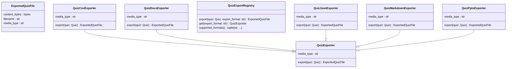

# Диаграмма классов: Export

Описывает систему экспорта квизов в различные форматы файлов.

## Классы

- **QuizExporter** — абстрактный базовый класс с полем `media_type` и абстрактным методом `export(quiz) -> ExportedQuizFile`.
- **QuizJsonExporter** — экспорт в JSON.
- **QuizDocxExporter** — экспорт в DOCX: карточки вопросов и ключ ответов.
- **QuizPptxExporter** — экспорт в PPTX: презентация в стиле quiz-show.
- **QuizMarkdownExporter** — экспорт в Markdown для LMS и заметок.
- **QuizCsvExporter** — экспорт в CSV для Excel и импорта.
- **QuizExportRegistry** — реестр всех экспортёров. Методы: `get(format)`, `export(quiz, format)`, `supported_formats()`.
- **ExportedQuizFile** — результат экспорта: `content_bytes`, `filename`, `media_type`.

## Связи

Все конкретные экспортёры наследуют `QuizExporter`. `QuizExportRegistry` агрегирует все экспортёры и предоставляет единую точку входа.

## Диаграмма

