# Диаграмма классов: Generation

Описывает систему генерации квизов: оркестраторы, диспетчер, RAG-пайплайн, профили и вспомогательные компоненты.

## Оркестраторы генерации

- **DirectGenerationOrchestrator** — генерирует квиз напрямую из полного текста документа.
- **RagGenerationOrchestrator** — генерирует квиз через RAG: чанкинг, векторный индекс, извлечение релевантного контекста.
- **GenerationOrchestratorDispatcher** — диспетчер. `direct_max_chars` (до 15 000 — direct), `rag_min_chars` (от 30 000 — RAG).
- **SingleQuestionRegenerationOrchestrator** — перегенерирует один вопрос без пересоздания квиза. Возвращает `SingleQuestionRegenerationResult`.

## Построители запросов

- **DirectGenerationRequestBuilder** — формирует `StructuredGenerationRequest` для direct-режима. Метод `resolve_prompt_key` выбирает промпт.
- **SingleQuestionRegenerationRequestBuilder** — формирует запрос для перегенерации одного вопроса.

## RAG-компоненты

- **EmbeddedChunk** — чанк текста с вектором эмбеддинга: `chunk`, `embedding`.
- **ScoredChunk** — чанк с оценкой релевантности: `chunk`, `score`.
- **InMemoryVectorIndex** — векторный индекс в памяти. Метод `search(query_vector)` возвращает ранжированные `ScoredChunk`.
- **RagCacheEntry** — кэш эмбеддингов и метаданных чанков для повторного использования без перевычисления.

## Профили и качество

- **GenerationProfileResolver** — резолвит профиль генерации по имени. Возвращает `ResolvedGenerationProfile`.
- **ResolvedGenerationProfile** — итоговый профиль: `profile_name`, `model_name`, `inference_parameters`.
- **GenerationQualityChecker** — проверяет качество квиза: число вопросов и соответствие ожидаемым типам.

## Логирование и статус

- **FileSystemGenerationDiagnosticLogger** — пишет диагностические JSON-логи на диск. Методы: `log_success`, `log_validation_failure`, `log_runtime_failure`.
- **GenerationPipelineEvent** — событие пайплайна: `document_id`, `quiz_id`, `status`, `step`, `error_code`, `error_message`, `metadata`.
- **GenerationPipelineStep** — перечисление шагов пайплайна.
- **GenerationRunStatus** — перечисление статусов: success, validation_failed, runtime_failed.
- **SingleQuestionRegenerationResult** — итог перегенерации: `Quiz`, `regenerated_question`, `model_name`, `prompt_version`.

## Диаграмма

```mermaid
classDiagram
  class DirectGenerationOrchestrator {
    generate(document_id: str, generation_request: GenerationRequest) GenerationResult
  }
  class DirectGenerationRequestBuilder {
    build(document: DocumentRecord, generation_request: GenerationRequest) StructuredGenerationRequest
    resolve_prompt_key(generation_request: GenerationRequest) str
  }
  class EmbeddedChunk {
    chunk : TextChunk
    embedding : tuple[float, ...]
  }
  class FileSystemGenerationDiagnosticLogger {
    storage_path : Path
    log_runtime_failure() Path
    log_success() Path
    log_validation_failure() Path
  }
  class GenerationOrchestratorDispatcher {
    direct_max_chars : int
    rag_min_chars : int
    dispatch(document_id: str, generation_request: GenerationRequest) GenerationResult
  }
  class GenerationPipelineEvent {
    document_id : str
    error_code : str | None
    error_message : str | None
    metadata : dict[str, Any]
    quiz_id : str | None
    request_summary : dict[str, Any]
    status
    step
    to_dict() dict[str, Any]
    to_log_extra() dict[str, Any]
  }
  class GenerationPipelineStep {
    name
  }
  class GenerationProfileResolver {
    resolve() ResolvedGenerationProfile
  }
  class GenerationQualityChecker {
    ensure_quality(quiz: Quiz, expected_question_count: int) None
  }
  class GenerationRunStatus {
    name
  }
  class InMemoryVectorIndex {
    dimension : int
    embedded_chunks : tuple[EmbeddedChunk, ...]
    search(query_vector: Sequence[float]) tuple[ScoredChunk, ...]
  }
  class RagCacheEntry {
    cache_key : str
    chunk_overlap : int
    chunk_size : int
    document_hash : str
    embedded_chunks : tuple[EmbeddedChunk, ...]
    embedding_model_name : str
    index_metadata : dict[str, int]
    from_dict(payload: dict[str, Any]) RagCacheEntry
    to_dict() dict[str, Any]
  }
  class RagGenerationOrchestrator {
    generate(document_id: str, generation_request: GenerationRequest) GenerationResult
  }
  class ResolvedGenerationProfile {
    inference_parameters : Mapping[str, Any]
    model_name : str | None
    profile_name : str
  }
  class ScoredChunk {
    chunk : TextChunk
    score : float
  }
  class SingleQuestionRegenerationOrchestrator {
    regenerate() SingleQuestionRegenerationResult
  }
  class SingleQuestionRegenerationRequestBuilder {
    build() StructuredGenerationRequest
    prompt_version() str
  }
  class SingleQuestionRegenerationResult {
    model_name : str
    prompt_version : str
    quiz : Quiz
    regenerated_question : Question
  }
  GenerationPipelineEvent --> GenerationPipelineStep : step
  GenerationPipelineEvent --> GenerationRunStatus : status
```

