# Диаграмма классов: LLM

Описывает уровень взаимодействия с LLM-провайдерами: абстракцию, конкретные клиенты, реестр и retry-механизм.

## Абстракция провайдера

- **LLMProvider** — абстрактный интерфейс с тремя методами: `healthcheck()`, `generate_structured()`, `embed()`.

## Конкретные клиенты

- **LMStudioClient** — клиент LM Studio. Structured output через JSON schema, эмбеддинги, healthcheck.
- **OllamaClient** — клиент Ollama. Нативный HTTP API: `/api/chat`, `/api/embed`, `/api/tags`.
- **ExternalAPIClient** — клиент внешнего OpenAI-compatible API. Поддерживает API-ключ и произвольный base URL.

Все три наследуют `LLMProvider`.

## Реестр и маршрутизация

- **ProviderName** — перечисление: `lm_studio`, `ollama`, `external_api`. Метод `normalize` приводит строку к enum.
- **ProviderRegistry** — реестр активных провайдеров. Методы: `is_enabled`, `ensure_enabled`, `enforced_provider`.
- **RegistryEnforcedProvider** — обёртка: проверяет через реестр что провайдер включён. Наследует `LLMProvider`.
- **ProviderRuntime** — runtime-контейнер: хранит `active_provider` и `registry`.

## Повторные попытки

- **RetryPolicy** — политика retry: `max_retries`, `base_backoff_seconds`, `backoff_multiplier`. Экспоненциальная задержка.
- **RetryingCaller** — исполняет вызов с retry при retryable-ошибках.

## Диаграмма

```mermaid
classDiagram
  class ExternalAPIClient {
    embed(request: EmbeddingRequest) EmbeddingResponse
    generate_structured(request: StructuredGenerationRequest) StructuredGenerationResponse
    healthcheck() ProviderHealthStatus
  }
  class LLMProvider {
    embed(request: EmbeddingRequest)* EmbeddingResponse
    generate_structured(request: StructuredGenerationRequest)* StructuredGenerationResponse
    healthcheck()* ProviderHealthStatus
  }
  class LMStudioClient {
    embed(request: EmbeddingRequest) EmbeddingResponse
    generate_structured(request: StructuredGenerationRequest) StructuredGenerationResponse
    healthcheck() ProviderHealthStatus
  }
  class OllamaClient {
    embed(request: EmbeddingRequest) EmbeddingResponse
    generate_structured(request: StructuredGenerationRequest) StructuredGenerationResponse
    healthcheck() ProviderHealthStatus
  }
  class ProviderName {
    name
    normalize(provider_name: ProviderName | str) ProviderName
  }
  class ProviderRegistry {
    enabled_provider_names : tuple[ProviderName, ...]
    registered_provider_names : tuple[ProviderName, ...]
    enforced_provider(provider_name: ProviderName | str) LLMProvider
    ensure_enabled(provider_name: ProviderName | str) ProviderName
    is_enabled(provider_name: ProviderName | str) bool
  }
  class ProviderRuntime {
    active_provider
    registry
  }
  class RegistryEnforcedProvider {
    provider
    provider_name
    registry
    embed(request: EmbeddingRequest) EmbeddingResponse
    generate_structured(request: StructuredGenerationRequest) StructuredGenerationResponse
    healthcheck() ProviderHealthStatus
  }
  class RetryPolicy {
    backoff_multiplier : float
    base_backoff_seconds : float
    max_retries : int
    backoff_for_attempt(attempt_index: int) float
  }
  class RetryingCaller {
    execute(operation: Callable) ResponseT
  }
  ExternalAPIClient --|> LLMProvider
  LMStudioClient --|> LLMProvider
  OllamaClient --|> LLMProvider
  RegistryEnforcedProvider --|> LLMProvider
  ProviderRuntime --> LLMProvider : active_provider
  RegistryEnforcedProvider --> LLMProvider : provider
  RegistryEnforcedProvider --> ProviderName : provider_name
  ProviderRuntime --> ProviderRegistry : registry
  RegistryEnforcedProvider --> ProviderRegistry : registry
```

