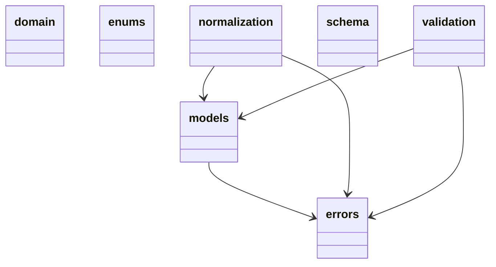

# Диаграмма пакетов: Domain

Показывает структуру и зависимости модулей внутри пакета `domain`.

## Модули

- **domain** — корневой пакет, агрегирует все подмодули.
- **models** — датаклассы доменных сущностей: `Quiz`, `Question`, `Option`, `DocumentRecord` и др.
- **errors** — иерархия исключений: `BackendError`, `DomainValidationError`, `LLMProviderError` и др.
- **normalization** — нормализация сырого вывода LLM в доменные модели.
- **validation** — бизнес-валидация квизов и вопросов.
- **enums** — перечисления: `Difficulty`, `Language`, `QuizType`.
- **schema** — JSON-схемы для structured output.

## Зависимости

- `models` использует `errors` при десериализации.
- `normalization` использует `errors` и `models`.
- `validation` использует `errors` и `models`.

## Диаграмма

