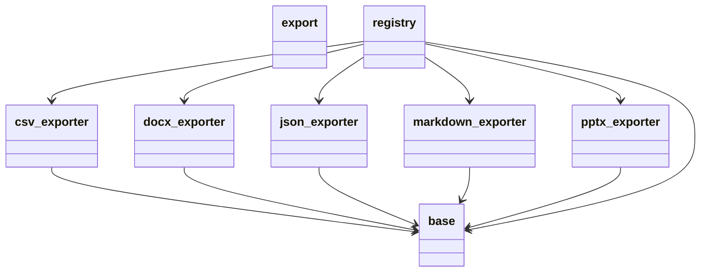

# Диаграмма пакетов: Export

Показывает структуру и зависимости модулей внутри пакета `export`.

## Модули

- **export** — корневой пакет экспорта.
- **base** — базовый класс `QuizExporter` и модель `ExportedQuizFile`.
- **json_exporter** — экспортёр в JSON.
- **docx_exporter** — экспортёр в DOCX.
- **pptx_exporter** — экспортёр в PPTX.
- **markdown_exporter** — экспортёр в Markdown.
- **csv_exporter** — экспортёр в CSV.
- **registry** — `QuizExportRegistry`: агрегирует все экспортёры, предоставляет единую точку доступа.

## Зависимости

Все экспортёры зависят от `base`. `registry` зависит от `base` и всех пяти экспортёров.

## Диаграмма

