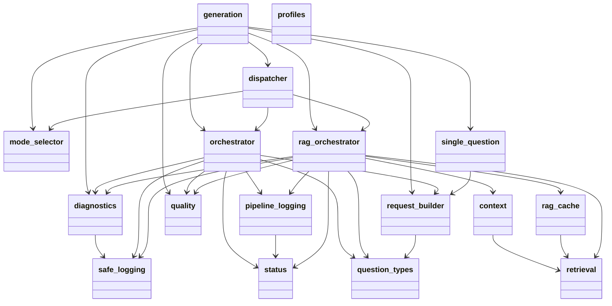

# Диаграмма пакетов: Generation

Показывает структуру и зависимости модулей внутри пакета `generation`.

## Модули

- **generation** — корневой пакет, экспортирует ключевые компоненты.
- **orchestrator** — direct-оркестратор: генерирует квиз из полного текста документа.
- **rag_orchestrator** — RAG-оркестратор для длинных документов (от 30 000 символов).
- **dispatcher** — выбирает между direct и RAG по длине документа.
- **mode_selector** — логика выбора режима (до 15 000 — direct, от 30 000 — RAG).
- **request_builder** — формирует `StructuredGenerationRequest` для direct-режима.
- **single_question** — перегенерация одного вопроса без пересоздания квиза.
- **context** — формирование RAG-контекста из найденных чанков.
- **retrieval** — векторный поиск по чанкам документа.
- **rag_cache** — кэш эмбеддингов и индексов для повторного использования.
- **profiles** — профили генерации и их резолвер.
- **quality** — проверка качества сгенерированного квиза.
- **question_types** — политики и правила для типов вопросов.
- **diagnostics** — запись диагностических JSON-логов.
- **pipeline_logging** — логирование событий пайплайна.
- **safe_logging** — утилиты безопасного логирования без утечки текста документа.
- **status** — перечисления статусов и шагов пайплайна.

## Ключевые зависимости

- `dispatcher` использует `mode_selector`, `orchestrator`, `rag_orchestrator`.
- `orchestrator` использует `diagnostics`, `pipeline_logging`, `quality`, `question_types`, `request_builder`, `safe_logging`, `status`.
- `rag_orchestrator` использует `context`, `rag_cache`, `retrieval`, `diagnostics`, `quality`, `pipeline_logging`, `status`.
- `context` и `rag_cache` используют `retrieval`.
- `single_question` использует `request_builder`.

## Диаграмма

