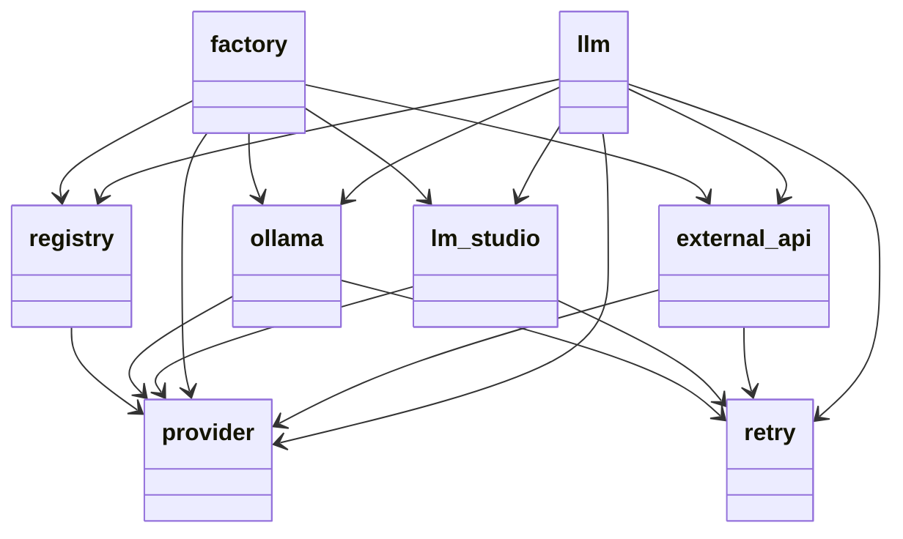

# Диаграмма пакетов: LLM

Показывает структуру и зависимости модулей внутри пакета `llm`.

## Модули

- **llm** — корневой пакет, экспортирует провайдеры и фабрику.
- **provider** — абстрактный класс `LLMProvider` и базовые модели.
- **lm_studio** — клиент LM Studio.
- **ollama** — клиент Ollama.
- **external_api** — клиент внешнего OpenAI-compatible API.
- **registry** — `ProviderRegistry` и `ProviderName`.
- **retry** — `RetryPolicy` и `RetryingCaller`.
- **factory** — фабрика: собирает `ProviderRuntime` из конфигурации, инстанцирует нужный клиент.

## Зависимости

- Все три клиента (`lm_studio`, `ollama`, `external_api`) зависят от `provider` и `retry`.
- `registry` зависит от `provider`.
- `factory` зависит от всех клиентов, `provider` и `registry`.
- `llm` экспортирует всё кроме `factory`.

## Диаграмма

