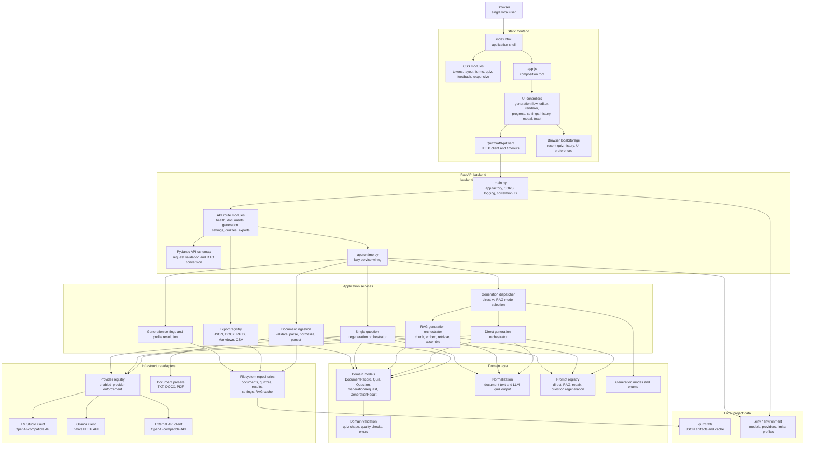

# QuizCraft High-Level Architecture Diagram for draw.io

This diagram is written in Mermaid format for diagrams.net / draw.io.

Import path in draw.io:

1. Open diagrams.net / draw.io.
2. Select `Insert -> Advanced -> Mermaid`.
3. Paste the Mermaid code below.

## Source Check

The diagram was checked against these implementation points:

- `frontend/index.html` and `frontend/app.js`: static shell and frontend composition root.
- `frontend/api/client.js`: HTTP boundary from frontend to backend.
- `backend/app/main.py`: FastAPI app factory, CORS, logging, correlation middleware, route registration.
- `backend/app/api/*.py`: route layer and API schemas.
- `backend/app/api/runtime.py`: service graph construction.
- `backend/app/parsing/*.py`: validators and TXT/DOCX/PDF parsers.
- `backend/app/generation/*.py`: direct, RAG, dispatcher, retrieval, and question-regeneration flows.
- `backend/app/domain/*.py`: domain models, validation, normalization, enums, errors, schemas.
- `backend/app/export/*.py`: export registry and format adapters.
- `backend/app/llm/*.py`: provider abstraction, registry, LM Studio, Ollama, external API clients.
- `backend/app/storage/*.py`: filesystem-backed JSON repositories under `.quizcraft`.
