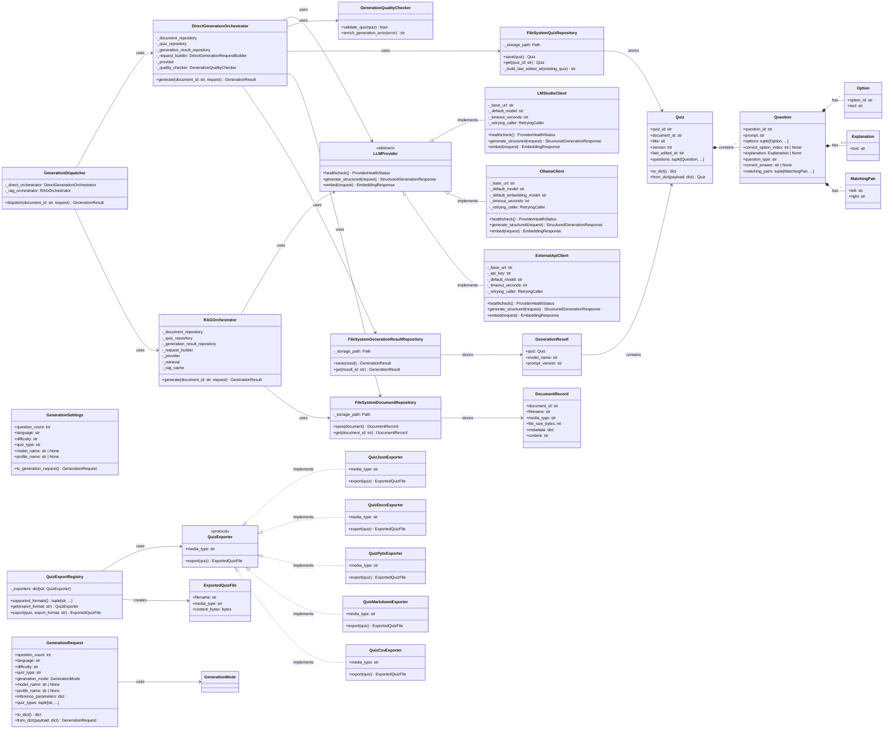

# QuizCraft - Диаграмма классов

## Обзор архитектуры классов

Диаграмма показывает основные классы и их взаимосвязи в проекте QuizCraft, включая доменные модели, провайдеров LLM, систему генерации и экспорта.

## Диаграмма классов

## Описание классов

### Доменные модели (Domain Models)
- **Quiz** - Основной агрегат квиза с вопросами и метаданными
- **Question** - Вопрос квиза с опциями и объяснениями
- **Option** - Вариант ответа для вопроса
- **Explanation** - Пояснение к вопросу
- **MatchingPair** - Пара для вопросов на соответствие
- **GenerationRequest** - Запрос на генерацию квиза
- **GenerationSettings** - Сохраненные настройки генерации
- **GenerationResult** - Результат генерации квиза
- **DocumentRecord** - Запись о загруженном документе

### LLM провайдеры
- **LLMProvider** - Абстрактный интерфейс провайдера
- **LMStudioClient** - Клиент для LM Studio
- **OllamaClient** - Клиент для Ollama
- **ExternalApiClient** - Клиент для внешних API

### Система генерации
- **DirectGenerationOrchestrator** - Прямая генерация квизов
- **RAGOrchestrator** - RAG генерация для длинных документов
- **GenerationDispatcher** - Диспетчер генерации
- **GenerationQualityChecker** - Проверка качества генерации

### Система экспорта
- **QuizExporter** - Протокол экспортера
- **QuizExportRegistry** - Реестр экспортеров
- **Конкретные экспортеры** - JSON, DOCX, PPTX, Markdown, CSV
- **ExportedQuizFile** - Результат экспорта

### Хранилище
- **FileSystemQuizRepository** - Файловое хранилище квизов
- **FileSystemDocumentRepository** - Файловое хранилище документов
- **FileSystemGenerationResultRepository** - Файловое хранилище результатов

## Взаимосвязи

1. **Агрегаты**: Quiz содержит вопросы, вопросы содержат опции
2. **Наследование**: LLM провайдеры реализуют общий интерфейс
3. **Композиция**: Экспортеры реализуют протокол QuizExporter
4. **Зависимости**: Оркестраторы используют репозитории и провайдеры
5. **Хранилище**: Репозитории сохраняют соответствующие модели
