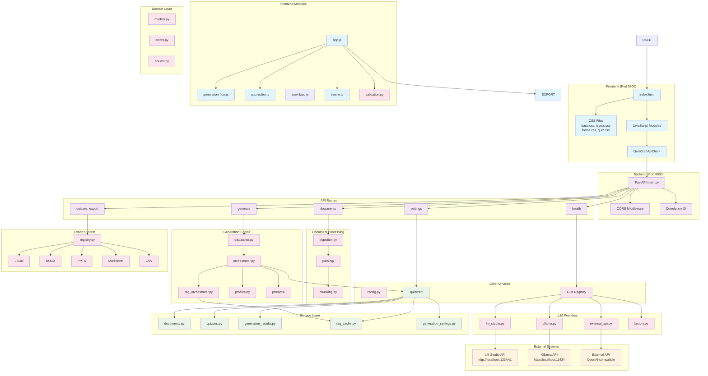

# QuizCraft - Диаграмма компонентов проекта

## Обзор архитектуры

QuizCraft - это веб-приложение для генерации учебных квизов из документов с поддержкой русского языка. Архитектура разделена на frontend и backend компоненты с локальным хранением данных.

## Диаграмма компонентов

## Описание компонентов

### Frontend компоненты
- **index.html** - Основная HTML страница приложения
- **CSS модули** - Стили для различных компонентов интерфейса
- **JavaScript модули** - Модульная архитектура фронтенда
- **QuizCraftApiClient** - HTTP клиент для взаимодействия с backend API

### Backend компоненты
- **FastAPI Application** - Основное веб-приложение с middleware
- **API Routes** - Эндпоинты для различных операций
- **Core Services** - Конфигурация, регистрация провайдеров, хранилище
- **Domain Layer** - Модели данных, валидация, ошибки

### Обработка документов
- **Document Parsing** - Парсинг TXT, DOCX, PDF файлов
- **Text Chunking** - Разделение текста на части для обработки
- **Document Ingestion** - Загрузка и предварительная обработка

### Генерация квизов
- **Generation Dispatcher** - Диспетчер запросов генерации
- **Generation Orchestrator** - Оркестратор процесса генерации
- **RAG Orchestrator** - RAG (Retrieval-Augmented Generation) обработка
- **Prompt Registry** - Реестр промптов для LLM

### LLM провайдеры
- **LM Studio Provider** - Интеграция с LM Studio
- **Ollama Provider** - Интеграция с Ollama
- **External API Provider** - Интеграция с внешними API

### Экспорт
- **Export Registry** - Реестр экспортеров
- **Экспортеры** - JSON, DOCX, PPTX, Markdown, CSV

### Хранилище
- **Local Storage** - Локальное файловое хранилище в `.quizcraft/`
- **Различные хранилища** - Для документов, квизов, результатов, кеша

## Потоки данных

1. **Загрузка документа**: Frontend → API → Document Ingestion → Storage
2. **Генерация квиза**: Frontend → API → Generation Dispatcher → LLM Provider → Storage
3. **Редактирование**: Frontend → API → Quiz Storage
4. **Экспорт**: Frontend → API → Export Registry → Frontend

## Конфигурация
- **Environment variables** - Настройки через .env файл
- **Generation profiles** - Профили генерации с параметрами
- **Provider configuration** - Настройки LLM провайдеров
