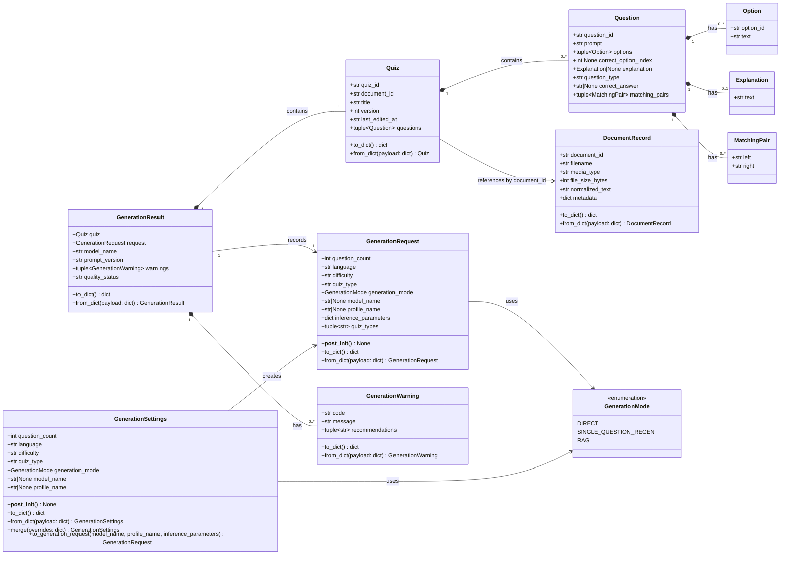

# Диаграмма классов доменной модели QuizCraft

## Назначение

Документ фиксирует укороченную диаграмму классов для ключевой доменной модели QuizCraft: квиз, вопросы, документ, настройки генерации, запрос генерации, результат генерации и предупреждения. Диаграмма соответствует текущим моделям из `./backend/app/domain/models.py` и режимам из `./backend/app/core/modes.py`.

## Диаграмма

## Краткий разбор сущностей

### `Quiz`

**Роль**: основной агрегат квиза, который хранится и отображается пользователю.

**Атрибуты**:

- **`quiz_id`**: уникальный идентификатор квиза.
- **`document_id`**: ссылка на документ, по которому был создан квиз.
- **`title`**: заголовок квиза.
- **`version`**: версия квиза, используется при сохранении и редактировании.
- **`last_edited_at`**: время последнего изменения.
- **`questions`**: набор вопросов `Question`.

**Методы**:

- **`to_dict()`**: сериализует квиз в JSON-совместимый словарь.
- **`from_dict(payload)`**: восстанавливает объект `Quiz` из JSON-совместимого словаря.

### `Question`

**Роль**: один вопрос квиза. Поддерживает разные типы вопросов через комбинацию полей.

**Атрибуты**:

- **`question_id`**: уникальный идентификатор вопроса.
- **`prompt`**: текст вопроса.
- **`options`**: варианты ответа для `single_choice` и `true_false`.
- **`correct_option_index`**: индекс правильного варианта для вопросов с выбором.
- **`explanation`**: пояснение к ответу, если оно есть.
- **`question_type`**: тип вопроса: `single_choice`, `true_false`, `fill_blank`, `short_answer` или `matching`.
- **`correct_answer`**: текстовый правильный ответ для `fill_blank` и `short_answer`.
- **`matching_pairs`**: пары для вопросов типа `matching`.

**Методы**: собственных методов нет; объект является структурой данных внутри `Quiz`.

### `Option`

**Роль**: вариант ответа в вопросах с выбором.

**Атрибуты**:

- **`option_id`**: идентификатор варианта.
- **`text`**: текст варианта ответа.

**Методы**: собственных методов нет.

### `Explanation`

**Роль**: пояснение к вопросу или правильному ответу.

**Атрибуты**:

- **`text`**: текст пояснения.

**Методы**: собственных методов нет.

### `MatchingPair`

**Роль**: одна пара для вопроса на сопоставление.

**Атрибуты**:

- **`left`**: левая часть пары.
- **`right`**: правая часть пары, то есть полный ответ, а не символический код.

**Методы**: собственных методов нет.

### `DocumentRecord`

**Роль**: сохраненная запись документа после загрузки, извлечения и нормализации текста.

**Атрибуты**:

- **`document_id`**: уникальный идентификатор документа.
- **`filename`**: исходное имя файла.
- **`media_type`**: MIME-тип документа.
- **`file_size_bytes`**: размер файла в байтах.
- **`normalized_text`**: нормализованный текст, который используется генерацией и RAG.
- **`metadata`**: технические метаданные документа.

**Методы**:

- **`to_dict()`**: сериализует документ в JSON-совместимый словарь.
- **`from_dict(payload)`**: восстанавливает `DocumentRecord` из словаря.

### `GenerationRequest`

**Роль**: доменный запрос на генерацию квиза. Он фиксирует пользовательские параметры и параметры модели для конкретной генерации.

**Атрибуты**:

- **`question_count`**: требуемое количество вопросов.
- **`language`**: язык генерации.
- **`difficulty`**: сложность вопросов.
- **`quiz_type`**: legacy-строка с выбранным типом или списком типов через запятую.
- **`generation_mode`**: режим генерации `GenerationMode`.
- **`model_name`**: выбранная модель, если задана явно.
- **`profile_name`**: выбранный профиль провайдера, если задан явно.
- **`inference_parameters`**: параметры инференса, например `temperature`.
- **`quiz_types`**: нормализованный набор выбранных типов вопросов.

**Методы**:

- **`__post_init__()`**: нормализует `quiz_types`, сохраняя обратную совместимость с `quiz_type`.
- **`to_dict()`**: сериализует запрос генерации.
- **`from_dict(payload)`**: восстанавливает запрос генерации из словаря.

### `GenerationSettings`

**Роль**: сохраненные настройки генерации по умолчанию для локального single-user backend.

**Атрибуты**:

- **`question_count`**: количество вопросов по умолчанию.
- **`language`**: язык по умолчанию.
- **`difficulty`**: сложность по умолчанию.
- **`quiz_type`**: выбранный тип или набор типов вопросов.
- **`generation_mode`**: режим генерации по умолчанию.
- **`model_name`**: модель по умолчанию, если выбрана.
- **`profile_name`**: профиль провайдера по умолчанию, если выбран.

**Методы**:

- **`__post_init__()`**: проверяет корректность настроек и нормализует строки.
- **`to_dict()`**: сериализует настройки.
- **`from_dict(payload)`**: восстанавливает настройки из словаря.
- **`merge(overrides)`**: применяет явные переопределения к сохраненным настройкам.
- **`to_generation_request(...)`**: преобразует настройки в `GenerationRequest`, добавляя модель, профиль и параметры инференса.

### `GenerationResult`

**Роль**: результат генерации, который объединяет готовый квиз, исходный запрос и диагностические данные.

**Атрибуты**:

- **`quiz`**: сгенерированный или восстановленный квиз.
- **`request`**: запрос, по которому была выполнена генерация.
- **`model_name`**: фактически использованная модель.
- **`prompt_version`**: версия промпта.
- **`warnings`**: предупреждения о частично пригодном результате.
- **`quality_status`**: итоговый статус качества, например `ok` или `warning`.

**Методы**:

- **`to_dict()`**: сериализует результат генерации вместе с квизом, запросом и предупреждениями.
- **`from_dict(payload)`**: восстанавливает `GenerationResult` из словаря.

### `GenerationWarning`

**Роль**: пользовательское или техническое предупреждение о результате генерации.

**Атрибуты**:

- **`code`**: машинно-читаемый код предупреждения.
- **`message`**: человекочитаемое сообщение.
- **`recommendations`**: рекомендации пользователю по проверке или повторной генерации.

**Методы**:

- **`to_dict()`**: сериализует предупреждение.
- **`from_dict(payload)`**: восстанавливает предупреждение из словаря.

### `GenerationMode`

**Роль**: перечисление поддерживаемых режимов генерации.

**Значения**:

- **`DIRECT`**: прямая генерация по нормализованному тексту документа.
- **`SINGLE_QUESTION_REGEN`**: регенерация одного вопроса.
- **`RAG`**: генерация через разбиение документа, embeddings и выбор релевантного контекста.

**Методы**: собственных методов у перечисления нет; проверка поддержки режима вынесена в `GenerationModeRegistry`.

## Основные связи

1. **`Quiz` содержит `Question`**: квиз является агрегатом вопросов.
2. **`Question` содержит `Option`, `Explanation`, `MatchingPair`**: конкретный набор вложенных объектов зависит от типа вопроса.
3. **`GenerationResult` содержит `Quiz` и `GenerationWarning`**: результат хранит финальное состояние, которое видит пользователь.
4. **`GenerationResult` ссылается на `GenerationRequest`**: это позволяет понять, с какими настройками была выполнена генерация.
5. **`GenerationSettings` создает `GenerationRequest`**: сохраненные настройки превращаются в конкретный запрос перед запуском генерации.
6. **`Quiz` связан с `DocumentRecord` через `document_id`**: прямого вложения документа в квиз нет, используется идентификатор документа.

## Примечания по соответствию проекту

- В `DocumentRecord` используется поле `normalized_text`, а не `content`.
- В `GenerationResult` есть `request`, `warnings` и `quality_status`; это важно для журнала генерации и показа предупреждений пользователю.
- `GenerationSettings` содержит `generation_mode`, поэтому настройки знают, какой режим генерации будет применяться.
- `GenerationMode` сейчас включает три режима: `direct`, `single_question_regen`, `rag`.
- Малые классы `Option`, `Explanation`, `MatchingPair` намеренно оставлены без методов, потому что в проекте они являются immutable value objects.
