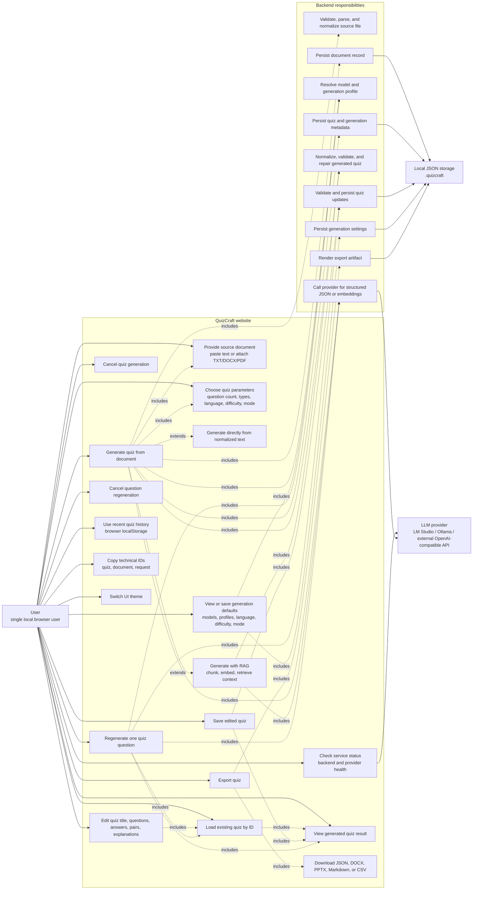

# QuizCraft Use Case Diagram for draw.io

This diagram is written in Mermaid format for diagrams.net / draw.io.

Import path in draw.io:

1. Open diagrams.net / draw.io.
2. Select `Insert -> Advanced -> Mermaid`.
3. Paste the Mermaid code below.

## Source Check

The diagram was checked against these implementation points:

- `frontend/api/client.js`: health, settings, upload, generation, quiz read/update, question regeneration.
- `backend/app/main.py`: FastAPI application setup and route registration.
- `backend/app/api/*.py`: actual HTTP routes.
- `backend/app/api/runtime.py`: backend service wiring.
- `backend/app/generation/*.py`: direct, RAG, and single-question generation flows.
- `backend/app/export/registry.py`: export formats.
- `backend/app/storage/*.py`: local JSON storage layout.
